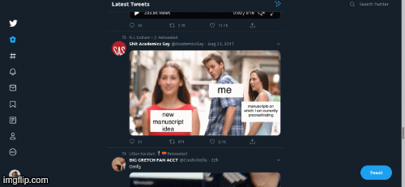

<h1 align="center">
  Twitter for Hipster
</h1>

Memes and other idle distractions tend to be super popular on Twitter.  I'm a grumpy hipster so I don't want to see any of that.

<h3>This browser extension removes any tweets that have more than 1000 likes or retweets.</h3>

Here's a comparison. Notice how there is that super overused distracted boyfriend meme.  Well, with this add-on, you won't see that anymore.

It's not perfect. If somebody retweets something really popular, but adds their own dumb little inoccuous comment to it then, yeah, that'll still show up.

## Installation

I haven't put this on the official firefox or chrome webstores yet (remember that I'm a hipster so I really can't even be bothered). But it can still be installed on Firefox from this link.

<h3><a href="https://lots-of-things.github.io/twitter-for-hipster/twitter_for_hipster-1.0-fx.xpi">[Install add-on]</a></h3>

Or for more tech hipster cred, you can also install it the very manual way too. Just clone this repo and follow your browser's local extension install instructions.

- [Load extensions into Chrome locally](https://developer.chrome.com/extensions/getstarted#manifest)
- [Load add-ons into Firefox locally](https://developer.mozilla.org/en-US/docs/Mozilla/Add-ons/WebExtensions/Temporary_Installation_in_Firefox)

## Developing

I forked this project from [Thomas Wang](https://twitter.com/ThomasWang)'s [Minimal Theme](https://github.com/thomaswang/minimal-twitter). His add-on minimalizes my Twitter experience and is also an essential twitter add-on for any good hipster on Twitter.

This is just my personal hipterization, but I'm open to extensions that remove more of the middle of the road, easily digestible content from my timeline.

## Support the original Minimal Twitter project!

I'm obviously way too cool to need any support.  But I only figured out how to make this by looking at [Thomas Wang](https://twitter.com/ThomasWang)'s [Minimal Theme](https://github.com/thomaswang/minimal-twitter) code.  If you found this project useful, consider supporting Thomas on [GitHub Sponsors](https://github.com/sponsors/thomaswangio) :)
